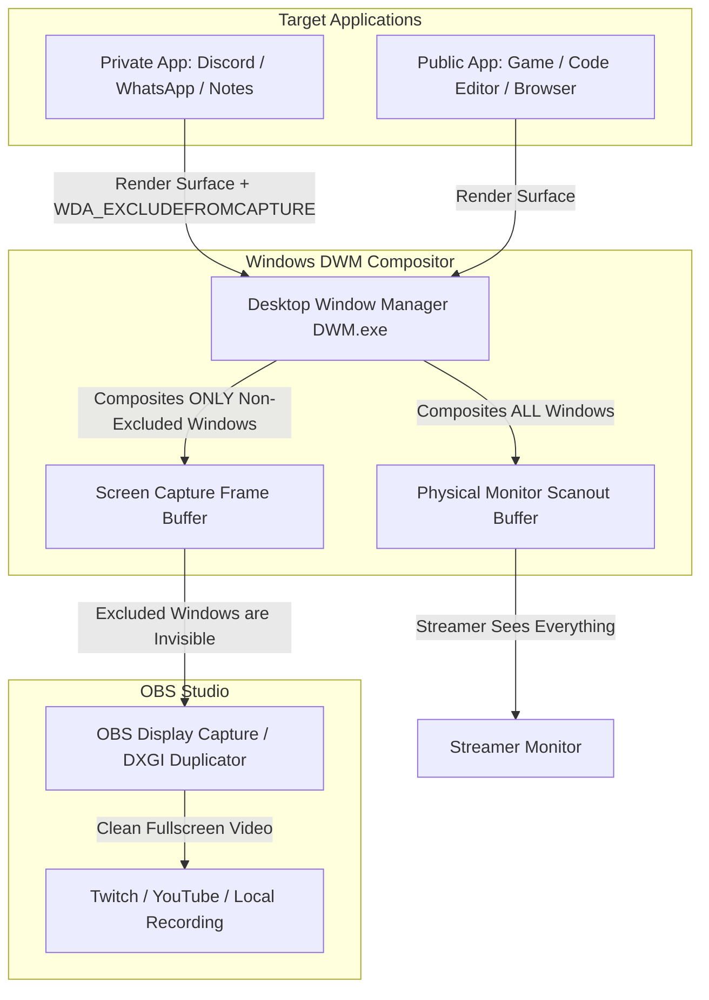

# OBS Studio Window Hider Plugin: Technical Feasibility, Architecture & Research Report

**Project Code Name:** `hidder-win` (OBS Window Hider / Cloaker)  
**Target Platform:** Windows 10 (2004+, Build 19041+) & Windows 11 (64-bit)  
**Target Host:** OBS Studio 30.0+ (Qt6 / 64-bit)  
**Document Classification:** Engineering Research & System Architecture  

---

## 1. Executive Summary & Feasibility Assessment

### 1.1 Is It Possible?
**Yes, 100% possible.** Windows natively supports excluding arbitrary windows from screen capture and video recordings while keeping them fully visible, active, and interactive on the user's physical monitor.

### 1.2 Core Finding
Microsoft introduced the `WDA_EXCLUDEFROMCAPTURE` affinity flag in Windows 10 version 2004 (Build 19041). When this flag is applied to a window handle (`HWND`), the Windows **Desktop Window Manager (DWM)** compositor automatically removes the window from all capture pipelines (OBS Display Capture, DXGI Desktop Duplication, Windows Graphics Capture, Discord screen share, Snipping Tool, Zoom, etc.). 

DWM renders the underlying wallpaper and background applications into the capture frame as if the hidden window does not exist.

### 1.3 The Primary Engineering Challenge
The Windows API function `SetWindowDisplayAffinity` enforces a strict **kernel-level ownership check**:
- A process can only alter the display affinity of windows created by its own threads.
- Calling `SetWindowDisplayAffinity(targetHwnd, WDA_EXCLUDEFROMCAPTURE)` directly from inside the OBS Studio process (`obs64.exe`) fails immediately with `ERROR_ACCESS_DENIED` (Error code `5`).

### 1.4 The Solution
To hide external applications (e.g., Discord, WhatsApp, Telegram, Chrome, Notes, Calculator), our plugin must execute the affinity call **from within the target process's context**. 

This is achieved using the same architecture OBS Studio itself uses for Game Capture:
- A dedicated **Helper Executable** (`hidder-helper32.exe` / `hidder-helper64.exe`).
- A lightweight **Payload DLL** or **Message Hook** injected into the target process to invoke `SetWindowDisplayAffinity(hwnd, WDA_EXCLUDEFROMCAPTURE)`.
- A fallback **Privacy Mask Filter** inside OBS for protected processes (e.g., anti-cheat protected games or system-protected apps) where injection is disallowed.

---

## 2. Deep Dive: Windows Display Affinity & DWM Compositor

### 2.1 The Windows Capture Pipeline



### 2.2 Evolution of `SetWindowDisplayAffinity`
The Win32 API function signature:
```cpp
BOOL SetWindowDisplayAffinity(
    HWND  hWnd,
    DWORD dwAffinity
);
```

| Flag | Value | Minimum OS | Behavior in Screen Capture | Physical Monitor Behavior |
| :--- | :--- | :--- | :--- | :--- |
| `WDA_NONE` | `0x00000000` | Windows 7 | Normal: Captured completely. | Visible |
| `WDA_MONITOR` | `0x00000001` | Windows 7 | Rendered as a **solid black box** in capture. | Visible |
| `WDA_EXCLUDEFROMCAPTURE` | `0x00000011` | Windows 10 (2004+) | **Completely invisible.** Underlying desktop and windows are rendered seamlessly. | Fully Visible & Usable |

### 2.3 How DWM Achieves Seamless Invisibility
1. When DWM compositing runs for a display capture request (such as DXGI Output Duplication or Windows Graphics Capture `Direct3D11CaptureFramePool`), DWM inspects each window's visual tree.
2. If `WDA_EXCLUDEFROMCAPTURE` is present on the window's internal `tagWND` structure:
   - DWM skips the window's visual layer during the capture composition pass.
   - Any windows or desktop wallpaper beneath the excluded window are blended into that screen region.
3. No performance penalty is incurred on OBS because DWM performs this during its hardware-accelerated composition pass.

---

## 3. Cross-Process Invocation: Methods & Feasibility Analysis

Because `SetWindowDisplayAffinity` cannot be called cross-process directly, we evaluated four distinct implementation approaches:

### Method Comparison Matrix

| Method | Feasibility | Antivirus Risk | Stability | 32/64-bit Support | Complexity |
| :--- | :---: | :---: | :---: | :---: | :---: |
| **Method 1: Remote Thread DLL Injection** | High | Medium | High | Requires Dual Helpers | Medium |
| **Method 2: Message Hook (`SetWindowsHookEx`)** | High | Low | High | Requires Dual Helpers | Low |
| **Method 3: DLL-less Shellcode Injection** | Medium | High | Medium | Architecture-specific | High |
| **Method 4: OBS Privacy Mask Filter (Fallback)** | 100% | Zero | 100% | Universal | Low |

---

### Detailed Method Breakdown

#### Method 1: Remote Thread DLL Injection (Standard Production Approach)
- **Mechanism:**
  1. OBS plugin helper calls `OpenProcess(PROCESS_CREATE_THREAD | PROCESS_VM_OPERATION | PROCESS_VM_WRITE, ...)`.
  2. Allocates memory in target using `VirtualAllocEx` and writes the path of `hidder-payload.dll` via `WriteProcessMemory`.
  3. Spawns remote thread using `CreateRemoteThread` targeting `Kernel32!LoadLibraryW`.
  4. In `hidder-payload.dll`, upon load, it receives an IPC command with the target `HWND` and desired affinity, executes `SetWindowDisplayAffinity(targetHwnd, WDA_EXCLUDEFROMCAPTURE)`, and triggers `FreeLibraryAndExitThread`.
- **Precedent:** Used by `radiantly/Invisiwind` and OBS Studio's own `win-capture/inject-helper`.

#### Method 2: Windows Hooking (`SetWindowsHookExW`)
- **Mechanism:**
  1. The helper installs a targeted window hook on the thread ID of the target window using `SetWindowsHookExW(WH_CALLWNDPROC, HookProc, hDll, targetThreadId)`.
  2. The helper sends a custom registered window message `WM_SET_AFFINITY_TRIGGER` to the window via `SendMessageCallbackW` or `PostMessageW`.
  3. When the target thread processes the message, the OS automatically loads `hidder-payload.dll` into the target address space.
  4. The hook procedure inspects the custom message, calls `SetWindowDisplayAffinity(hWnd, dwAffinity)`, and removes the hook.
- **Advantage:** Far less likely to trigger heuristic antivirus scanners than `CreateRemoteThread`.

#### Method 3: Fallback Privacy Mask Filter (No Injection)
- **Mechanism:**
  1. For anti-cheat protected applications (e.g., Riot Vanguard, BattlEye, Easy Anti-Cheat) or DRM-protected software where code injection is blocked, the plugin switches to an OBS source filter.
  2. The filter reads the window's screen bounding box (`GetWindowRect`).
  3. The Display Capture source applies a shader mask over those coordinates (e.g., Gaussian blur, privacy shield pattern, black box, or custom streamer watermark).

---

## 4. System Architecture & Components

```mermaid
graph TB
    subgraph OBS Studio Process (obs64.exe)
        PluginCore[hidder-win.dll - Plugin Core]
        QtDock[Qt6 Dock UI: 'Window Hider']
        RulesEngine[Auto-Hide Rules & Config JSON]
        HotkeyHandler[OBS Hotkey Manager]
        IpcClient[Named Pipe / IPC Client]
    end

    subgraph Helper Subsystem
        IpcServer[Named Pipe Server]
        Helper64[hidder-helper64.exe]
        Helper32[hidder-helper32.exe]
    end

    subgraph Target Application Processes
        Target64[64-bit App e.g., Discord / Chrome]
        Payload64[hidder-payload64.dll]
        Target32[32-bit App e.g., Legacy Tools]
        Payload32[hidder-payload32.dll]
    end

    QtDock -->|User toggles window| RulesEngine
    HotkeyHandler -->|Hotkey pressed| RulesEngine
    RulesEngine --> PluginCore
    PluginCore --> IpcClient

    IpcClient <-->|IPC Pipe: CMD_HIDE / CMD_UNHIDE| IpcServer
    IpcServer --> Helper64
    IpcServer --> Helper32

    Helper64 -->|Injects / Calls| Payload64
    Payload64 -->|SetWindowDisplayAffinity| Target64

    Helper32 -->|Injects / Calls| Payload32
    Payload32 -->|SetWindowDisplayAffinity| Target32
```

### 4.1 Component Roles & Responsibilities

1. **`hidder-win.dll` (OBS Plugin Module)**
   - Implements `obs_module_load()` and `obs_module_unload()`.
   - Links to `libobs` and `obs-frontend-api`.
   - Registers a native Qt6 Dock Widget (`obs_frontend_add_custom_qdock`).
   - Hosts hotkeys (`obs_hotkey_register_frontend`).
   - Maintains persistence (saves auto-hidden processes to `config.json`).

2. **Qt6 Dock UI ("Window Hider Dock")**
   - Displays a live table of active visible top-level windows.
   - Shows: Application Icon, Process Name, Window Title, Current Status (`Visible` / `Hidden from Stream`).
   - Search & Filter bar for instant lookup.
   - Toggle switch / Checkbox for each window.
   - "Auto-Hide Rules" tab: Streamer can specify process names (e.g., `Discord.exe`, `Telegram.exe`, `WhatsApp.exe`) to always auto-hide whenever they launch.

3. **Window Watcher Thread (`SetWinEventHook`)**
   - Runs in the background of the plugin.
   - Listens for `EVENT_OBJECT_CREATE` and `EVENT_SYSTEM_FOREGROUND`.
   - If an application on the "Auto-Hide Rules" list is launched or restored from the system tray, it automatically applies `WDA_EXCLUDEFROMCAPTURE` without manual streamer intervention.

4. **`hidder-helper64.exe` & `hidder-helper32.exe` (Dual Helpers)**
   - OBS 64-bit cannot directly inject into 32-bit processes using standard Win32 calls.
   - Dual helpers ensure 100% compatibility with both 64-bit and 32-bit software.
   - Isolate any potential injection failures from OBS Studio, ensuring OBS never crashes.

---

## 5. Technology Stack & Language Choices

### 5.1 Recommended Programming Languages
- **Primary Language:** **C++20 / C++17**
  - **Why:** OBS Studio plugins are natively C/C++. C++ provides zero-cost abstractions, RAII memory safety, and seamless integration with both `libobs` and `Qt6`.
- **Win32 Layer:** **C / Win32 API**
  - Direct access to `user32.lib`, `kernel32.lib`, `dwmapi.lib`, and Windows internals.
- **Build System:** **CMake (version 3.20+)**
  - Standard build system across the OBS Studio ecosystem (`obs-plugintemplate`).

### 5.2 Libraries & Dependencies
- `libobs` (`obs.h`, `obs-module.h`): OBS core plugin interface.
- `obs-frontend-api` (`obs-frontend-api.h`): For dock registration and OBS UI integration.
- `Qt6` (`QtWidgets`, `QtCore`, `QtGui`): For the native dock widget UI.
- `nlohmann/json`: Lightweight single-header JSON library for saving streamer rules and settings.
- Win32 APIs:
  - `SetWindowDisplayAffinity`
  - `EnumWindows`, `GetWindowTextW`, `GetWindowThreadProcessId`
  - `SetWinEventHook`
  - `CreateRemoteThread`, `VirtualAllocEx`, `WriteProcessMemory`

---

## 6. Edge Cases & Robustness Strategies

### 6.1 Chromium / Electron Applications (Discord, Slack, Spotify, Chrome)
- **Problem:** Modern browsers and Electron apps spawn multiple processes and multiple child/tool windows (context menus, popups, notifications).
- **Solution:** 
  - The plugin tracks the root process ID and window hierarchy.
  - When the user selects "Discord", the helper enumerates all top-level `HWND`s belonging to the Discord process tree and applies `WDA_EXCLUDEFROMCAPTURE` to all of them.
  - The `SetWinEventHook` automatically intercepts newly spawned popups or context menus from that PID and immediately applies affinity.

### 6.2 Administrator / Elevated Processes
- **Problem:** If a target application runs as Administrator (e.g., Task Manager, an admin IDE, or elevated command prompt), a standard-user OBS cannot open its process handle (`OpenProcess` fails with `ERROR_ACCESS_DENIED`).
- **Solution:**
  - Detect process elevation level.
  - If OBS is running without admin rights, display an informative badge in the UI: `"Requires OBS Run as Administrator"`.
  - Provide a one-click button in settings or prompt to elevate the helper process via `ShellExecuteExW` with the `runas` verb.

### 6.3 Windows Minimization & Tray Restoration
- **Problem:** Some applications destroy and recreate their top-level `HWND` when minimized to the system tray and restored.
- **Solution:**
  - The `SetWinEventHook` monitors `EVENT_OBJECT_SHOW` for monitored process names. When a window is restored with a new `HWND`, affinity is automatically re-applied within milliseconds.

### 6.4 Antivirus False Positive Prevention
- **Problem:** Security software often flags direct `CreateRemoteThread` injection.
- **Solution:**
  - Implement **Method 2 (`SetWindowsHookEx`)** as the default mechanism, which uses standard Windows message dispatching rather than foreign thread spawning.
  - Code-sign the compiled helper and DLL binaries with a valid certificate.

---

## 7. Implementation Roadmap & Project Layout

### 7.1 Proposed Directory Structure
```
hidder win/
├── CMakeLists.txt                 # Master CMake build configuration
├── .agents/                       # Workspace rules & assistant configurations
├── research.md                    # This comprehensive research document
├── src/
│   ├── plugin-main.cpp            # OBS module entry point (obs_module_load)
│   ├── ui/
│   │   ├── hider-dock.hpp         # Qt6 Dock widget declaration
│   │   ├── hider-dock.cpp         # Window list table, search, toggle controls
│   │   └── rules-dialog.cpp       # Auto-hide rule configuration
│   ├── core/
│   │   ├── window-manager.hpp     # Window enumeration & tracking
│   │   ├── window-manager.cpp     # EnumWindows, WinEventHook handler
│   │   ├── process-affinity.hpp   # IPC dispatcher to helper processes
│   │   └── config-manager.cpp     # JSON persistence for auto-hide rules
│   └── helper/
│       ├── helper-main.cpp        # Lightweight standalone helper executable
│       └── payload-dll.cpp        # Injected payload executing SetWindowDisplayAffinity
└── cmake/
    └── FindLibObs.cmake           # OBS Studio SDK finder script
```

### 7.2 Phased Development Plan

#### Phase 1: Core Win32 Proof of Concept (POC)
- Build a standalone C++ test tool that lists visible windows and successfully hides selected windows using `SetWindowDisplayAffinity` and the helper injection.
- Verify with OBS Display Capture, Windows Snipping Tool (`Win+Shift+S`), and Discord screen share to validate zero-bleed invisibility.

#### Phase 2: Dual Helpers & Injection Architecture
- Implement `hidder-helper64.exe` and `hidder-helper32.exe`.
- Establish secure Named Pipe IPC communication between OBS and the helpers.
- Implement both `SetWindowsHookEx` (low AV risk) and `CreateRemoteThread` fallback.

#### Phase 3: OBS Plugin Lifecycle & Qt6 Dock UI
- Integrate with `obs-frontend-api`.
- Create the custom dock in Qt6 with real-time process icons, window titles, and toggle buttons.
- Register OBS hotkeys ("Toggle Hide Current Active Window").

#### Phase 4: Event Hooks & Auto-Hide Automation
- Implement `SetWinEventHook` to detect newly launched apps and window recreations.
- Implement auto-hide rules (e.g., auto-hide Telegram whenever it opens).

#### Phase 5: Testing, Hardening & Packaging
- Test across various target applications: Win32 classic apps, WPF, UWP/WinUI3, Electron (Discord/Slack), and browsers.
- Package as an easy installer (`.exe` / `.zip`) following OBS standard plugin folder hierarchy (`obs-plugins/64bit/`).

---

## 8. Conclusion

Building an OBS Studio plugin to hide selected windows from full-screen capture is **completely feasible and practical**. By utilizing Windows 10/11's native `WDA_EXCLUDEFROMCAPTURE` API coupled with an isolated helper architecture (identical to OBS's own Game Capture engine), streamers can safely run full-screen display captures without risking accidental leaks of sensitive windows, chats, passwords, or personal notes.
